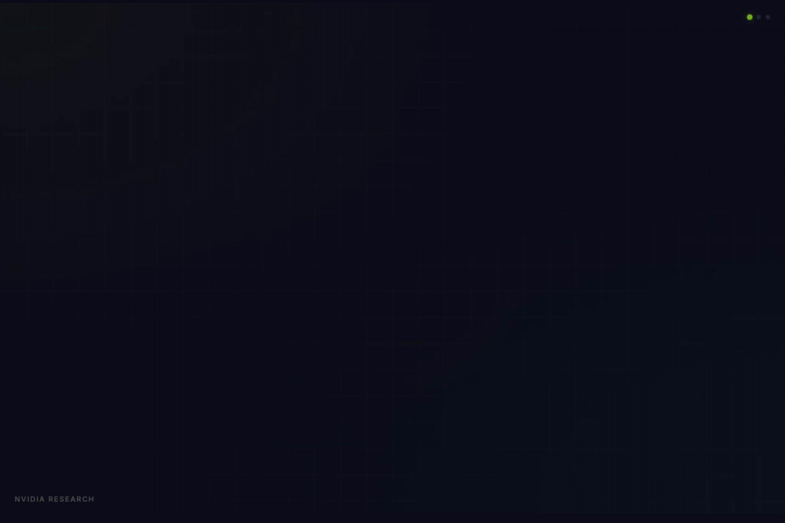
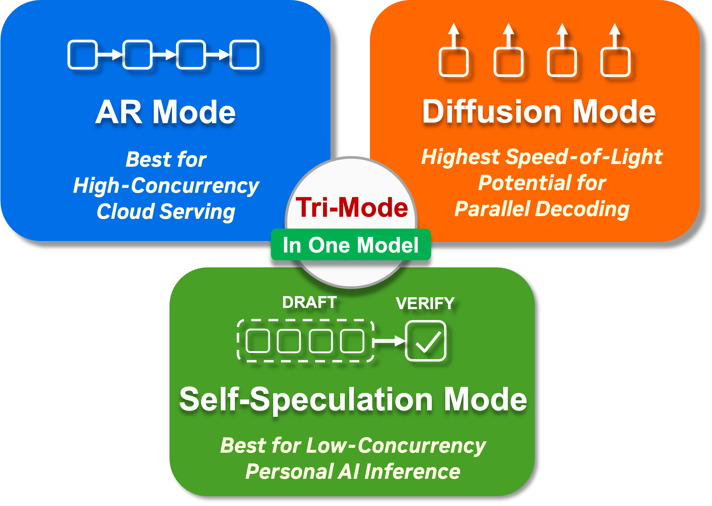
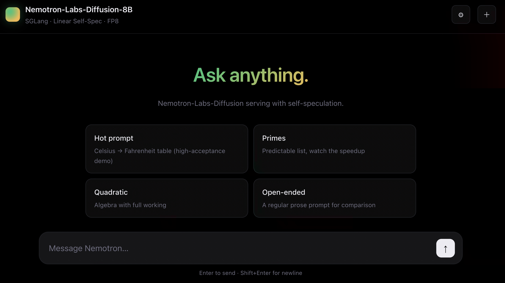

# Nemotron-Labs-Diffusion

[](https://huggingface.co/collections/nvidia/nemotron-labs-diffusion)
[](https://github.com/NVIDIA/NeMo-Skills)
[](https://www.nvidia.com/en-us/agreements/enterprise-software/nvidia-nemotron-open-model-license/)

<div align="center">

[](./assets/demo.mp4)

</div>

## 💡 TLDR

**Nemotron-Labs-Diffusion** is a *tri-mode* language model that supports both **AR decoding** and **diffusion-based parallel decoding** by simply switching the attention pattern of the same model during inference. The synergy between these two modes enables a third mode — **self-speculation** — where the same model performs diffusion-based parallel drafting and AR verification with a shared KV cache, achieving high acceptance lengths and decoding efficiency. The seamless mode switching by just changing attention patterns enables high efficiency at varying concurrency levels in different deployment scenarios with one single model.

<p align="center" style="border-radius: 10px">
  
</p>


## TABLE OF CONTENTS

1. [News](#news)
2. [Modes](#modes)
3. [Quick start — chat scripts](#quick-start--chat-scripts)
4. [Serving on a DGX Spark — SGLang](#serving-on-a-dgx-spark--sglang)
5. [Benchmark eval — evaluate.py (one script, no server)](#benchmark-eval--evaluatepy-one-script-no-server)
6. [Benchmark eval at scale — eval.sh](#benchmark-eval-at-scale--evalsh)
7. [Layout](#layout)
8. [Outputs](#outputs)
9. [Citation](#citation)
10. [Acknowledgement](#acknowledgement)
11. [License](#license)

## News

- [x] [2026.05.19] Public release of our 3B / 8B / 14B base, instruction, and vision-language models.

## Modes

The Nemotron-Labs diffusion-LM family exposes three decoding paths. `eval.sh`
selects between them via `--mode`:

| `--mode`        | Engine       | Model call                            | Notes                                                              |
|-----------------|--------------|---------------------------------------|--------------------------------------------------------------------|
| `ar`            | `ar_native`  | `model.ar_generate(...)`              | Pure autoregressive decoding                                       |
| `dlm`           | `nemotron`   | `model.generate(...)`                 | Block-diffusion sampling with confidence-thresholded unmasking     |
| `linear_spec`   | `nemotron`   | `model.linear_spec_generate(...)`     | Linear self-speculation; pass `--lora` to attach the draft adapter |

## Quick start — chat scripts

The fastest way to play with the model. Each script loads the model from HF,
takes one user message from stdin, and prints the assistant reply + NFE.

```bash
pip install "transformers>=5.0" torch peft   # peft only needed for the LoRA variant

# Single-turn examples — pick a mode
python chat/chat_ar.py                # AR via model.ar_generate
python chat/chat_dlm.py               # diffusion via model.generate
python chat/chat_linear_spec.py       # linear self-spec, no LoRA
python chat/chat_linear_spec_lora.py  # linear self-spec, with the bundled draft LoRA

# Multi-turn interactive chat (unified launcher with knobs)
python chat/chat.py --mode dlm
python chat/chat.py --mode linear_spec_lora --max-new-tokens 1024 --block-length 32
```

All five scripts mirror the snippets from the HF model card; the only logic
they add is a default `--model /data1/linyewei/models/Nemotron-Labs-Diffusion-8B` and a tiny
chat-history loop in `chat.py`.

## Serving on a DGX Spark — SGLang

For interactive low-latency serving on a [DGX Spark](https://www.nvidia.com/en-us/products/workstations/dgx-spark/)
(or any aarch64 + Blackwell host with Docker), see
**[sglang_spark/](./sglang_spark/README.md)** — a step-by-step deployment guide
that brings up `/data1/linyewei/models/Nemotron-Labs-Diffusion-8B` on the SGLang
DLLM-onboarding branch with Linear self-speculation + LoRA-enhanced drafter. (The AR/diffusion modes are also supported.)

The SGLang code lives in the upstream PR stack tracked at
[sgl-project/sglang#25802](https://github.com/sgl-project/sglang/issues/25802);
the guide uses [`hutm/sglang @ upstream/2-dllm-lora-ar`](https://github.com/hutm/sglang/tree/upstream/2-dllm-lora-ar)
(PR #2 — LoRA-aware LinearSpec execution).

A single-file HTML chat client (`sglang_spark/index.html`) ships alongside the
guide. You will get the following interactive interface from it.

<p align="center">
  <a href="./sglang_spark/README.md"></a>
</p>


## Benchmark eval — `evaluate.py` (one script, no server)

A self-contained Python evaluator. One process: load model → iterate the
benchmark dataset → call the right `model.X_generate` → score inline →
print pass@1 + TPF. No SLURM, no FastAPI server, no NeMo-Skills client, no
lm-evaluation-harness. Three pip packages:

```bash
pip install torch transformers datasets peft   # peft only for --lora

# 5-min smoke (50 problems, gsm8k)
python evaluate.py --mode dlm --tasks gsm8k --limit 50

# Full gsm8k (1319 problems), pick a decoding mode
python evaluate.py --mode ar           --tasks gsm8k
python evaluate.py --mode dlm          --tasks gsm8k
python evaluate.py --mode linear_spec  --tasks gsm8k
python evaluate.py --mode linear_spec  --tasks gsm8k --lora    # + bundled LoRA draft

# Multiple tasks in one process
python evaluate.py --mode dlm --tasks gsm8k,math-500
```

Output (progress line every 50 problems, plus a summary at the end):

```
── gsm8k ── loading gsm8k [test]
  [   50/ 1319]  acc=92.00%  avg_tok=308.4  avg_nfe= 51.7  TPF= 5.96  (   38s)
  [  100/ 1319]  acc=93.00%  avg_tok=305.9  avg_nfe= 51.2  TPF= 5.97  (   74s)
  ...
  ✓ gsm8k        acc=93.78%  avg_tok=302.0  avg_nfe= 52.1  TPF= 5.89  (1319 problems)
```

### Built-in tasks

| Task       | Dataset                          | Scorer                                                |
|------------|----------------------------------|-------------------------------------------------------|
| `gsm8k`    | `gsm8k` (config `main`, `test`)  | last `\boxed{N}` or trailing number == gold          |
| `math-500` | `HuggingFaceH4/MATH-500` (`test`)| last `\boxed{…}` equals gold (whitespace-normalized) |

Adding a new task is a 6-line addition to the `TASKS` dict at the top of
`evaluate.py` — pick a HF dataset, a `question_field`, a `gold_extractor`,
and a `scorer(model_out, gold) -> bool`. See the two existing tasks for the
exact shape.

For the production multi-GPU sweep across the full 10-benchmark suite
(HumanEval / MBPP / MMLU / IFEval / LiveCodeBench / AIME / GPQA — each
needs its own scoring path), use `eval.sh`.

## Benchmark eval at scale — `eval.sh`

> **SLURM + enroot/pyxis container required.** `eval.sh` submits sbatch
> jobs that bind-mount a pre-built container image (set `CONTAINER_IMAGE`)
> and launch one DLM worker per GPU + a load balancer + the NeMo-Skills
> eval client, all on the same node. If you don't already have a
> NeMo-Skills-ready `.sqsh` image and a SLURM cluster, use `evaluate.py`
> instead — it's the same eval semantics in one Python process with no
> external infra.

`eval.sh` is a thin orchestrator: it translates `--mode` into a set of env
vars and submits one SLURM job per (mode × benchmark group). Each job spins
up the inference server and the eval client on the same GPU node.

**Before your first real submission**, export your cluster-specific
container image and SLURM account (both are required; eval.sh fail-fasts
without them):

```bash
export CONTAINER_IMAGE=/path/to/your/nemo-skills-ready.sqsh
export ACCOUNT=<your-slurm-account>
# Optional:
export OUT_DIR=$PWD/eval_suit_results   # default
export HF_HOME=$HOME/.cache/huggingface  # default
```

```bash
# gsm8k sanity — pick a mode
bash eval.sh --mode ar          --benchmarks gsm8k:1
bash eval.sh --mode dlm         --benchmarks gsm8k:1
bash eval.sh --mode linear_spec --benchmarks gsm8k:1               # no LoRA
bash eval.sh --mode linear_spec --benchmarks gsm8k:1 --lora        # with the bundled LoRA

# Full default benchmark suite (no --benchmarks => 10 tasks)
bash eval.sh --mode dlm --gpus 8

# Inspect resolved settings without submitting
bash eval.sh --mode dlm --benchmarks gsm8k:1 --dry-run
```

### Linear-SS with the bundled LoRA

The LoRA `adapter_model.safetensors` (~137 MB) is gitignored — fetch it from the
HF model repo first:

```bash
bash scripts/fetch_bundled_lora.sh        # pulls into miscs/linear_spec_lora/
```

Then `eval.sh --mode linear_spec --lora` picks it up automatically (it is the
default `--lora-path`). `--draft-lora-only false` is also the default — the
public refactored model folded `linear_spec_generate_lora` into a LoRA-aware
unified `linear_spec_generate`, and the dispatcher auto-falls back when the
`_lora` variant is missing.

```bash
bash eval.sh --mode linear_spec --lora --benchmarks gsm8k:1
```

### Common overrides

See `bash eval.sh --help`. Most knobs default to per-mode reference values.

| Flag                                                                                  | Purpose                                                          |
|---------------------------------------------------------------------------------------|------------------------------------------------------------------|
| `--model HF_ID`                                                                       | HF model id (default: `/data1/linyewei/models/Nemotron-Labs-Diffusion-8B`)       |
| `--tokenizer ID_OR_PATH`                                                              | Tokenizer override; default = the one bundled with `--model`     |
| `--benchmarks "task1:reps,…"`                                                         | Comma-separated NeMo-Skills tasks                                |
| `--lora` / `--no-lora`                                                                | `linear_spec` only — attach the draft LoRA adapter               |
| `--lora-path DIR`                                                                     | LoRA adapter directory (default: `miscs/linear_spec_lora`)       |
| `--draft-lora-only BOOL`                                                              | Try `linear_spec_generate_lora` first; fall back to plain method |
| `--tokens`, `--block-length`, `--threshold`, `--temperature`, `--max-thinking-tokens` | per-knob overrides                                               |
| `--gpus N`, `--partition LIST`, `--account ACCT`, `--time HH:MM:SS`                   | SLURM controls                                                   |

## Layout

```
eval_suit/
├── evaluate.py                     # ★ one-script, no-server eval (the simple path)
├── eval.sh                         # SLURM-driven multi-GPU eval (the scale path)
├── chat/                           # mirror of the HF model-card snippets
│   ├── chat.py                     #   unified multi-turn launcher (--mode)
│   ├── chat_ar.py                  #   AR via model.ar_generate
│   ├── chat_dlm.py                 #   dLM via model.generate
│   ├── chat_linear_spec.py         #   linear_spec_generate, no LoRA
│   └── chat_linear_spec_lora.py    #   linear_spec_generate + bundled LoRA adapter
├── sglang_spark/                   # SGLang serving on a DGX Spark
│   ├── README.md                   #   step-by-step deployment guide
│   ├── launch_server.sh            #   thin wrapper around lmsysorg/sglang:spark
│   └── index.html                  #   single-file HTML chat client
├── scripts/
│   └── fetch_bundled_lora.sh       # pulls the linear_spec_lora adapter from HF
├── xp/                             # vendored helpers (slim build)
│   ├── examples/                   #   GPU-only pipeline script
│   ├── dlm_api/                    #   batch server, load balancer, algorithm registry
│   │   └── dlm_generate/           #     nemotron / ar_native / nemotron_mixed
│   └── nemo-skills/                #   eval_dlm.py + small upstream patches
├── miscs/                          # LoRA adapters (created by fetch script)
│   └── linear_spec_lora/           #   downloaded from the HF repo's bundled adapter
└── assets/                         # demo + result figures (mirrored from HF)
```

## Outputs

Each `(exp_name, benchmark)` pair gets its own subtree:

```
$OUT_DIR/<exp_name>/hf_base/<eval_dir_name>/
├── pipeline_group<N>.log              # full sbatch / pipeline log
├── results/eval-results/<task>/       # NeMo-Skills outputs (metrics.json, output-rs0.jsonl)
├── nfe_group<N>/nfe_log.jsonl         # per-batch NFE traces
├── server_info_group<N>.env           # server metadata
└── COMPLETED_group<N>  | FAILED_group<N>
```

Default `$OUT_DIR` is `$PWD/eval_suit_results`. Override with `--out-dir`.

## Citation

```bibtex
@techreport{fu2026nemotronlabsdiffusion,
  title       = {Nemotron-Labs-Diffusion: A Tri-Mode Language Model Unifying Autoregressive, Diffusion, and Self-Speculation Decoding},
  author      = {Yonggan Fu and Lexington Whalen and Abhinav Garg and Chengyue Wu and Maksim Khadkevich and Nicolai Oswald and Enze Xie and Daniel Egert and Sharath Turuvekere Sreenivas and Shizhe Diao and Chenhan Yu and Ye Yu and Weijia Chen and Sajad Norouzi and Jingyu Liu and Shiyi Lan and Ligeng Zhu and Jin Wang and Jindong Jiang and Morteza Mardani and Mehran Maghoumi and Song Han and Ante Jukic and Nima Tajbakhsh and Jan Kautz and Pavlo Molchanov},
  institution = {NVIDIA},
  year        = {2026},
  note        = {Technical report}
}
```

## Acknowledgement

- [NVIDIA / NeMo-Skills](https://github.com/NVIDIA/NeMo-Skills): the evaluation
  framework `eval_dlm.py` rides over. Thanks for their wonderful work.
- [SGLang](https://github.com/sgl-project/sglang) and the
  [DLLM-onboarding PR stack](https://github.com/sgl-project/sglang/issues/25802):
  the production-grade serving runtime for `sglang_spark/`.
- [HuggingFace / transformers](https://github.com/huggingface/transformers):
  the `AutoModel` + chat-template infrastructure for trust-remote-code loading.
- [HuggingFace / peft](https://github.com/huggingface/peft): LoRA attach for
  the Linear-SS drafter.
- The Nemotron-Labs team for the model and the tri-mode decoding paths.

## License

Inherits from the upstream HF model
([NVIDIA Open Model License](https://www.nvidia.com/en-us/agreements/enterprise-software/nvidia-nemotron-open-model-license/)).
